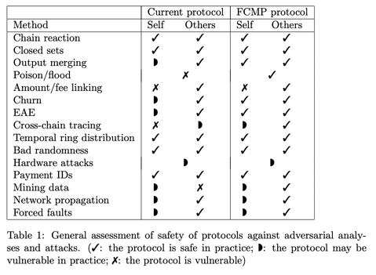

# On Private Money

## Monero's Limitations

One of the most fascinating developments in cryptocurrency has been the class of privacy-focused cryptoassets. Monero currently dominates this category in terms of usage (market cap of \$6.73B and 24h volume of \$110.49M) but it is not without its limitations. 

Monero's ring signature system provides each transaction input with a ring of decoy outputs plus their real one. In theory, an observer shouldn't tell which output in the ring was actually spent. But in practice, **set intersection attacks** and other heuristics have exposed limitations in their privacy model. 

In a set intersection attack, an adversary analyzes multiple transactions whose rings share common outputs in order to distinguish real spends by intersecting these sets. For example, suppose that Alice owns an old Monero output `A`. She spends it in a transaction on the main Monero chain forming a ring 

$$
    \text{Tx1} = \{A, B, C, D, E\}
$$

Because of Monero's ring signature, an observer can't tell which of the five is the real input. Now suppose Alice also spends the same output on a Monero fork:

$$
    \text{Tx1'} = \{F, G, A, H, I\}
$$

Each ring has 5 outputs, but `A` is the only one common in both, which isn't good. In Monero, a user's true spend should be computationally hidden among many decoys, but the *re-use* of the same output across multiple rings breaks this illusion. According to a recent review by Cypher Stack, this remains a practical [attack vector](https://moneroresearch.info/index.php?action=resource_RESOURCEVIEW_CORE&id=235#).

Reusing decoys in Monero has some serious ripple effects. If the real spend for a single output is ever revealed—through an exchange, user mistake, or clever analysis—it doesn't just affect that one transaction. It lets anyone rule out that output as a decoy in any other ring it appeared in. That, in turn, helps narrow down the real spends in those rings, and the process can repeat across the network. In Monero's early days, this was especially bad—over 65% of inputs didn't even use decoys, so they were trivially exposed. And even after mixins were added, researchers found that another ~22% of inputs could still be traced just by overlapping the right rings and [eliminating possibilities](https://eprint.iacr.org/2017/338.pdf#:~:text=%1Brst%20heuristic%20,any%20ground%20truth%20on%20RingCTs).

What's more troubling is that a powerful attacker could add their own known decoys to the ring. By flooding the network with transactions that reuse known or controlled outputs as decoys, they can "poison" the anonymity set. Once a few real spends are known, these poisoned rings make it much easier to strip away decoys and trace other transactions. It creates a chain reaction where even users who took care to protect their privacy can end up exposed if their transactions enter rings with adversaries. 

<!-- Insert Diagram Here -->

Modern Monero has strengthened its defenses against intersection attacks, though primarily through patches rather than rigorous cryptographic guarantees. Techniques like enforcing minimum ring sizes and refining decoy selection help mitigate "closed set" intersection attacks, where outputs only appear with each other and can thus be linked. While these measures have made analysis more difficult than in Monero's early years—when researchers were able to deanonymize up to 90% of transactions for as little as [~$1,000](https://eprint.iacr.org/2019/455.pdf)-resourced adversary with sufficient data can still carry out large-scale intersection attacks.

*Figure: Monero's resistance to various analysis techniques, adapted from Goodell, B. (2024). *History and state of Monero security analysis*. Unpublished manuscript. ✓ indicates practical safety, ◗ indicates potential vulnerability in practice, and ✗ indicates known vulnerability. As the table shows, Monero remains vulnerable or potentially*

## Zcash's Mathematical Guarantees

Unlike Monero, Zcash doesn't rely on probabilistic arguments with decoys. Instead, it achieves **ledger indistinguishability** using zero-knowledge proofs. Every shielded transaction in Zcash is cryptographically indistinguishable from random noise. And now, it is being accelerated in Zcash Engineer Sean Bowe's [Project Tachyon](https://seanbowe.com/blog/tachyon-scaling-zcash-oblivious-synchronization/). Succinctly, here is how Tachyon addresses the limitations of Monero:

| Problem | How Monero Suffers | How Tachyon Fixes It |
|:--------|:-------------------|:---------------------|
| Node Resource Use | Every decoy must be tracked; ring signatures and Bulletproofs increase block size | Zcash blocks with aggregated zk-SNARKs remain small and fast to verify |
| Decoy Analysis | Set intersection and timing leaks remain partially effective | No decoys exist in Zcash; every transaction is indistinguishable |
| User Privacy Trade-offs | Remote nodes or light wallets may see which outputs you scan | Oblivious syncing services can advance wallet state without learning anything about your notes |
| Transaction Throughput | Monero hits practical limits during spam (e.g. March 2024) | PCD allows scaling to high throughput with small block size and low validator burden |

In Project Tachyon, Bowe rethinks how wallets sync and interact with blockchain state in a secure manner. Tachyon introduces a model where wallets maintain a proof of their own synchronization (via [proof-carrying data](https://dspace.mit.edu/handle/1721.1/61151)), allowing validators to prune almost all historic data. By shifting secret distribution off-chain and removing reliance on encrypted note payloads in the ledger, it enables lean, stateless wallets and small, efficient blocks. This paves the way for Zcash to be able to scale massively without compromising privacy. For the full technical breakdown, check out Sean's blog on [Project Tachyon](https://seanbowe.com/blog/tachyon-scaling-zcash-oblivious-synchronization/). In the next blog, we will walk through a toy implementation of the accumulator from Project Tachyon!

